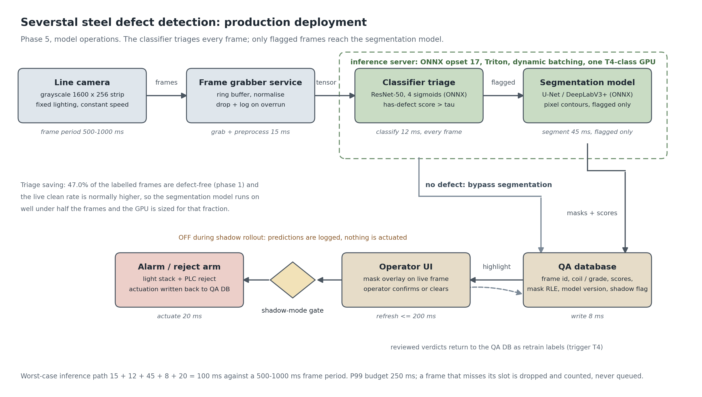

# Model Operations

This section describes how the models would be deployed on a real inspection line, and the plan for
maintaining them and updating their parameters once they are there. Measured results are quoted
from the phase 3 and phase 4 evaluation files (`outputs/metrics/`).

## 1. Deployment architecture

The figure is generated by `src/ops_arch_diagram.py`, so it regenerates with the repository rather
than living in a drawing tool.

The line camera is the assumption everything else rests on. It looks down at the strip from a fixed
mount under controlled lighting, produces the 1600 x 256 grayscale frames measured in phase 1, and
sees the strip pass at a constant speed. Fixed geometry and fixed lighting are what make a model
trained on last month's frames valid on today's, and they are also the first thing to break, which
is why hardware changes appear as a retrain trigger in section 6.

The frame grabber service owns the camera link. It normalises each frame into the tensor layout the
models expect and holds a short ring buffer. If inference falls behind, the grabber drops the
oldest frame and increments a counter rather than growing the buffer. An unbounded queue would turn
a latency problem into silent data loss: the line keeps running, the model keeps scoring frames
from thirty seconds ago, and nobody notices until a defective coil ships.

The classifier triages every frame. It is the multi-label EfficientNet-B2 head from phase 3, the
challenger that won every classification metric (macro-F1 0.934 vs ResNet-50's 0.904) and is also
the lighter model to serve, with four sigmoids rather than a softmax, because 6.41% of the defect
images in this dataset carry more than one class. The triage decision is not an argmax over the four heads. It is a threshold on the
has-defect score, and the threshold is a business parameter: recall matters more than precision
here because a missed defect ships and a false alarm only costs an operator ten seconds.

Only flagged frames enter the segmentation model. This is the main structural decision in the
design. Phase 1 measured 47.0% of the labelled images as defect-free, and a curated competition set
over-represents defects relative to a working line, so in production the clean fraction will be
higher still. The segmentation model is roughly four times the cost of the classifier per frame,
so triaging first means the expensive model runs on a minority of frames and the GPU can be sized
for that minority. Defect-free frames skip segmentation entirely and go straight to the database
with an empty mask.

Results land in the QA database, one row per frame: frame id, timestamp, coil id and steel grade
pulled from the MES, the four class scores, the mask as RLE or polygon, the model version string
that produced it, and a shadow flag. The model version column is what makes a later investigation
possible. Without it, a run of bad predictions cannot be attributed to a specific deployment.

The operator UI reads the same rows and overlays the predicted mask on the live frame. The operator
confirms or clears each flagged frame, and those verdicts write back to the database. That feedback
path is not decoration: it is the only source of labelled production data, and it feeds both the
false-positive monitor in section 9 and the retrain pool in section 7.

Actuation is last and is gated. When the gate is open, a confirmed defect above the severity
threshold raises the light stack and signals the PLC to fire the reject arm, and the actuation is
written back to the QA row so the physical action and the prediction that caused it stay linked.

## 2. Serving stack and ONNX export

Both models are exported to ONNX at a pinned opset and served from a model repository. Exporting
matters for a reason specific to a factory: the line PC should not carry a PyTorch install, a CUDA
toolkit matched to it, and the `segmentation-models-pytorch` version that happens to have been
current during training. ONNX turns the model into a file with a stable operator contract, so the
serving host and the training host can move independently.

The deployment contract is opset 17, static input shape 1 x 1 x 256 x 1600, FP16 weights with FP32
accumulation, and the preprocessing constants (mean and standard deviation) written into the model
metadata rather than reimplemented in the grabber. A preprocessing mismatch between training and
serving is the classic silent failure, and putting the constants in the artifact removes the chance
to get them out of step.

Between the two obvious servers, Triton is the recommendation. Two models run in sequence with a
conditional branch between them, which is exactly the ensemble case Triton handles natively, and
its dynamic batching lets several cameras share one GPU without hand-written batching in the
grabber. TorchServe would be the better choice if this were one model with no branch, because it
has less operational surface and a simpler handler API, but the triage structure is the whole point
of this design and Triton models it directly.

## 3. Latency budget

Severstal does not publish the line cadence, so it is stated here as an explicit assumption. A
cold-rolling line runs in the region of 1 to 2 m/s, and each 1600 x 256 frame covers roughly a
metre of strip along the direction of travel, which gives one frame per camera every 0.5 to 1.0
seconds. The budget is derived backwards from the shorter of those, a 500 ms frame period.

| Stage | Budget | Notes |
|---|---|---|
| Grab and preprocess | 15 ms | every frame |
| Classifier | 12 ms | every frame, batched across cameras |
| Segmentation | 45 ms | flagged frames only |
| QA database write | 8 ms | asynchronous, off the critical path |
| Actuation signal to PLC | 20 ms | flagged and confirmed frames only |
| **Worst-case total** | **100 ms** | against a 500 ms frame period |

The worst case is the flagged path, where every stage runs. That leaves a factor of five of
headroom at the fastest assumed cadence. The requirement is written as a P99, not a mean: P99 end
to end must stay under 250 ms, which is half the frame period, because a mean of 100 ms with a
one-second tail still misses coils. When a frame does miss its slot the grabber drops it and
increments the dropped-frame counter, and sustained drops above 0.5% of frames page the line
engineer.

The same numbers set the camera-per-GPU limit. At 2 frames per second per camera, one camera costs
about 24 ms of classifier time and, at a 40% flagged rate, another 36 ms of segmentation time per
second of wall clock. Sizing to 50% GPU utilisation to leave room for the tail, one T4-class card
comfortably serves eight cameras.

## 4. GPU server versus edge boxes

| | Line-side GPU server | Per-camera edge boxes |
|---|---|---|
| Hardware | one T4/A10-class card serving up to 8 cameras | Jetson-class box per camera |
| Latency | adds a network hop, a few ms on a local switch | no hop |
| Updating | one model repository to swap | N boxes to keep in sync |
| Failure domain | one box down stops all cameras | one box down stops one camera |
| Cost at 4 to 8 cameras | lower | higher |

The recommendation is the line-side server. At the frame rate and camera count in section 3 the
network hop is negligible next to a 500 ms period, and the operational argument dominates: a single
model repository means a promotion or a rollback is one action, whereas keeping eight edge boxes on
the same model version is a fleet-management problem that a plant IT team should not have to own
for this. Edge boxes become the right answer if the cameras end up spread over a long line where
the cable run is awkward, or if the plant network cannot be relied on, and the design does not
prevent that: the same ONNX artifacts run on a Jetson under Triton.

## 5. Shadow-mode rollout

The model does not touch the reject arm on the day it is deployed. In shadow mode it runs on live
frames at full rate and writes complete rows to the QA database with `shadow = true`, the operator
UI shows its overlays as advisory, and the actuation link is disabled at the gate shown in the
figure. Everything is exercised except the physical consequence, which means the latency, the
throughput and the drop rate are all measured under real load before anyone trusts a decision.

Exit criteria, all of which must hold together:

- at least 14 days of production and 200,000 scored frames, so more than one steel grade and more
  than one shift have passed through
- at least 2,000 frames reviewed by an operator, which is the sample needed for the agreement and
  false-positive numbers below to mean anything
- agreement with the operator verdict of at least 90% on those reviewed frames
- false-positive rate at most 1.5% on frames the operator cleared as defect-free. Phase 4 flags
  that a segmentation model can score well while predicting almost nothing, and the mirror of that
  failure is a model that flags everything; this is the check for the second one
- dropped frames below 0.5% and P99 latency under 250 ms over the whole window

Then the ramp goes in two steps rather than one. First the alarm and the operator highlight are
enabled while the reject arm stays disabled, for a further 7 days. Only after that does the reject
arm come on, and it comes on for one line first. Rolling straight from shadow to physical rejection
gives no intermediate state in which a bad model is visible but harmless.

## 6. Retrain triggers

Every trigger below is either an event the plant already records or a statistic the monitoring job
computes on a schedule. Each one names the quantity it watches and the value at which it fires,
because a trigger without a number cannot be implemented and cannot be audited afterwards. Firing a
trigger does not swap the model. It opens a retrain ticket, and the candidate that comes out still
has to beat the incumbent on the frozen golden test set and pass shadow validation before anything
on the line changes.

T1. Input drift on the grayscale histogram: two-sample Kolmogorov-Smirnov test, fires at D > 0.15
with alpha = 0.01. Every 24 hours the monitor builds a 256-bin intensity histogram from a random
sample of 100,000 pixels drawn across that day's frames and compares it against the same statistic
computed once on the frozen training set. The sample cap matters. A single 1600 x 256 frame already
carries 409,600 pixels, so over a day's frames KS returns p < 0.001 for differences far too small
to affect the model. We therefore gate on the effect size D and keep alpha only as a secondary
guard. D = 0.15 is about the separation a lighting change would have to produce before it is
visible in the sample images from phase 2.

T2. Prediction drift in the flagged-frame rate: fires at 5 percentage points absolute over a 7-day
rolling window. The baseline is the production flagged rate measured during the shadow period, not
the 53.0% prevalence of the labelled dataset, because a curated competition set is not a live
product mix. A slower clause fires at 3 percentage points sustained for two consecutive weeks,
since a gradual walk is exactly the failure a single-window threshold misses.

T3. Per-class score distribution shift: fires at a 0.10 shift in the median sigmoid score sustained
over 7 days. Each of the four heads is tracked separately against its shadow-period baseline. Class
2 gets a tighter bar of 0.05 because it has only 247 images in the dataset and 47 in validation, so
it is the head most likely to degrade without moving any pooled number.

T4. Accumulated human-reviewed labels: fires at 500 newly reviewed frames since the last training
run, or immediately at 100 frames where the operator's verdict disagreed with the model. Five
hundred is about 5% of the 10,054-image training split, which is the smallest addition with a
realistic chance of moving validation Dice. The disagreement path is faster because disagreements
are the informative examples rather than the average ones.

T5. Steel grade changeover: fires on any grade code in the MES that is absent from the training
snapshot, and on a per-grade flagged rate more than 8 percentage points off that grade's own mean
over its last 20 coils. An unseen grade also puts that coil into log-only mode straight away.
Surface finish and scale pattern move with grade, so a per-grade baseline is the only comparison
that carries information.

T6. Camera or lighting hardware replacement: actuation is disabled at the moment the swap is logged
in maintenance and stays disabled until a 1,000-frame recalibration check passes, meaning mean
frame intensity within 8 grey levels of the training mean and KS D < 0.10 against the training
histogram. Failing either check opens a retrain ticket instead of a recalibration. This is the one
trigger that does not wait for a statistic to accumulate, because a replaced lamp changes every
frame from the first one.

T7. Sustained false-positive rate: fires above 3% over a 7-day window, measured on frames the
operator reviewed and cleared. That is double the 1.5% ceiling the model must meet to leave shadow
mode, so it marks real degradation rather than week-to-week noise. It is kept separate from T2
because a model can hold its overall flagged rate steady while trading true positives for false
ones.

T8. Calendar backstop: fires at 90 days with no other trigger having fired. The pipeline retrains
on whatever labelled data has accumulated and runs the same golden-set comparison. This is not a
substitute for the drift triggers. It exists for drift slow enough to carry all the rolling
baselines along with it, which is the one case none of the windowed tests can see.

## 7. Retrain pipeline

A fired trigger opens a ticket and the pipeline runs end to end without anyone editing a notebook.

**Sampling.** The candidate pool is every flagged frame plus a 2% random sample of the frames the
classifier passed. The random sample is not optional. Sampling only what the model flagged trains
the next model on its own opinion, the training prevalence climbs with every cycle, and the false
negatives the model already misses are the exact frames that never enter the pool.

**Human review.** Sampled frames go to the review queue, where an operator or QA engineer confirms
the class and, for confirmed defects, corrects the mask. Frames that two reviewers disagree on are
kept and marked, because they are usually the genuinely ambiguous boundary cases.

**Merge.** Reviewed frames join the training set as a new data snapshot with its own id. The
phase 0 split protocol is reapplied to the new material with the same seed and the same
stratification on (has_defect, primary_class), so the train and validation halves stay comparable
across cycles.

**Retrain and compare.** The candidate is trained with the same recipe as the incumbent, then both
are scored on a frozen golden test set. That set is carved out once, never trained on, and never
refreshed except by an explicit and recorded decision. If the golden set is allowed to absorb new
production data, every model looks better than the last one and the comparison stops measuring
anything.

**Promotion rule.** The candidate is promoted only if, on the golden set, it improves Dice on
defect-bearing images by at least 0.01 with no more than 0.5 percentage points of regression in the
false-positive rate on defect-free images, and no per-class Dice falls by more than 0.02. Both
metrics are read from the phase 4 evaluation files (`outputs/metrics/seg_unet.json` and
`seg_deeplabv3p.json`); the incumbent's baseline values come from the same files. The deployed
segmenter is DeepLabV3+ (defect-only Dice 0.725, the winning challenger); U-Net (0.705) is the
fallback. A candidate that raises the headline Dice by inflating false positives fails this rule,
which is the point of stating both numbers.

## 8. Parameter update and versioning

The version string carries the metric, so the model on disk can be identified without opening a
tracking system: `deeplabv3p_r34_v20260807_dice0.7245.onnx`, meaning the DeepLabV3+ with a
ResNet-34 encoder, trained on the 2026-08-07 snapshot, scoring 0.7245 defect-only Dice on the
golden set. The classifier follows the same pattern with its own headline metric.

Each promotion writes a model registry entry recording the git commit of the training code, the
sha256 of `splits/train.csv` and `splits/val.csv`, the data snapshot id, the golden-set evaluation
json, the ONNX opset and the export environment, and the ticket that triggered the retrain. Those
six fields are what make a result reproducible a month later, and the split hash in particular is
what proves two models were compared on the same data rather than on two coincidentally similar
splits.

The swap itself is blue-green inside the Triton model repository. The new version is loaded
alongside the current one and receives shadow traffic first, with both versions scoring the same
frames and the disagreements logged. Once the shadow comparison is clean, the version policy points
at the new version and the old one stays loaded. Rollback is therefore repointing the version
policy and reloading, with a target of under 5 minutes from decision to previous model live. That
target is only credible because the old version was never unloaded, so rollback needs no download
and no rebuild.

No promotion skips shadow validation, including a rollback to a previously good model: a model that
was correct in March is not automatically correct against today's frames.

## 9. Production monitoring

| Metric | Alert threshold | Pages |
|---|---|---|
| Inference latency P50 / P99 | P99 > 250 ms for 5 min | line engineer |
| Throughput (frames per second per camera) | more than 10% below the camera's nominal rate | line engineer |
| Dropped frames | > 0.5% over 1 hour | line engineer |
| Flagged-frame rate time series | outside the shadow-period baseline by 5pp (control limits at 3 sigma) | data science on-call |
| Per-class median sigmoid score | shift > 0.10 over 7 days, > 0.05 for class 2 | data science on-call |
| Human-reviewed false-positive rate | > 3% over 7 days | data science on-call |
| Operator review backlog | > 500 unreviewed flagged frames | QA supervisor |
| Model version in use | any mismatch with the registry's active entry | data science on-call |
| GPU utilisation and memory | > 85% sustained for 30 min | line engineer |

The split of ownership is deliberate. Latency, throughput and drops are plant-infrastructure
problems and go to the line engineer, who can act on them within the shift. The drift and
false-positive metrics are model problems, they page the data science on-call, and their thresholds
are the same numbers as the retrain triggers in section 6 so that the monitor and the retrain
policy cannot drift apart. The review backlog is on the QA supervisor because an unreviewed queue
quietly starves both the false-positive metric and the retrain label pool, and that failure is
invisible in every other row of this table.
